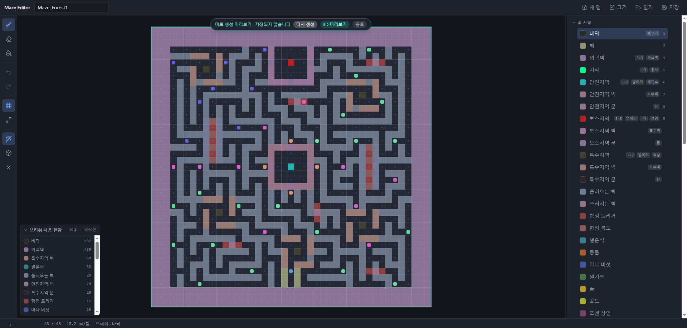
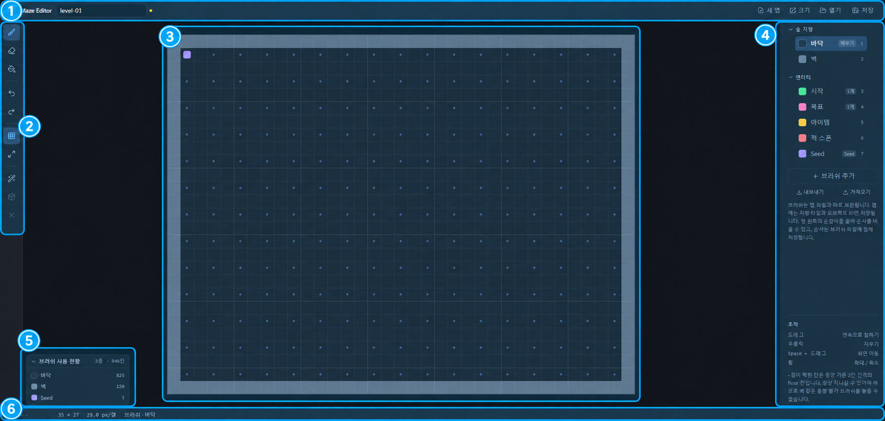
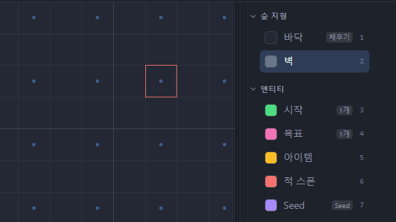
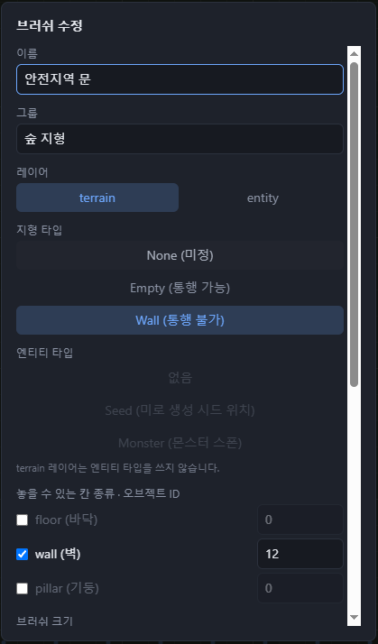
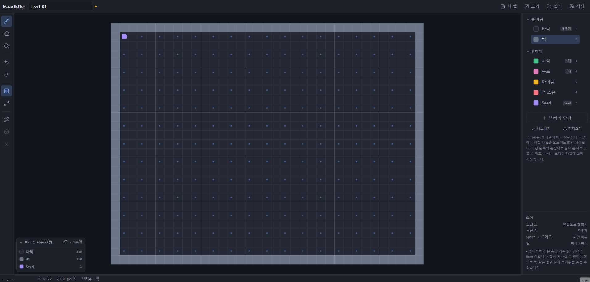
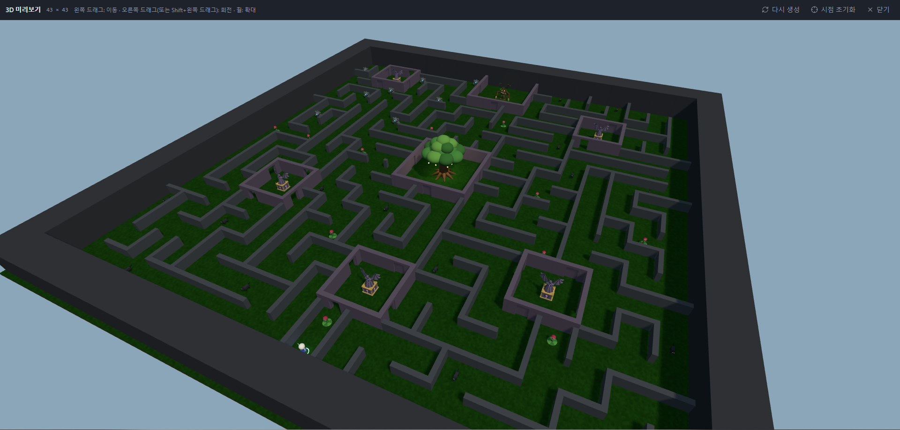
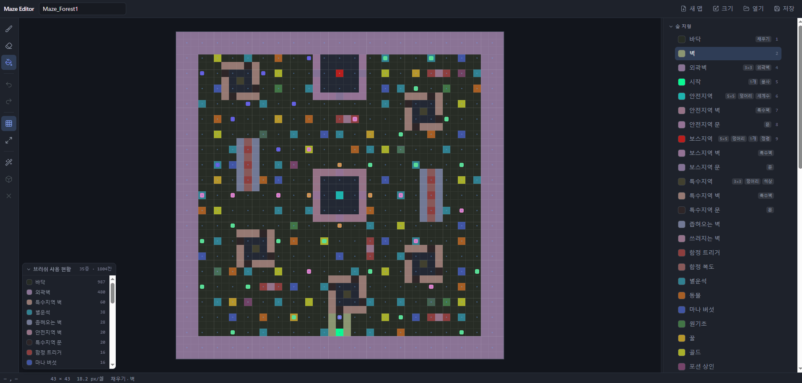

# Maze Editor

셀 격자 기반 미로 게임의 레벨을 그리는 브라우저용 맵 편집기입니다.
브러쉬로 벽·바닥·엔티티를 칠하고, 미로 자동 생성 결과를 2D와 3D로 미리 본 뒤, 게임이 읽는 JSON 맵 파일로 저장합니다.
서버 없이 브라우저 안에서만 동작합니다.

<!-- 📷 이미지: docs/images/editor.png
     예시 브러쉬와 예시 맵(Maze_Forest1)을 불러온 편집 화면 전체

-->

## 주요 기능

- **맵 칠하기** — 브러쉬·지우개·채우기 도구, 드래그로 이어 칠하기, 실행 취소/다시 실행
- **브러쉬 직접 정의** — 칸 종류별 오브젝트 ID, 놓을 수 있는 칸, 크기(1·3·5), 맵에 하나만 두기, 덩어리로 놓기, 채우기 허용
- **미로 생성 미리보기** — Seed 칸에서 출발하는 미로 생성 결과를 맵을 건드리지 않고 미리 보기
- **3D 미리보기** — 생성된 미로를 게임 속 비율과 높이로 둘러보기
- **브러쉬 사용 현황** — 맵에 쓰인 브러쉬와 칸 수, 클릭하면 해당 칸 강조
- **저장** — JSON 맵 파일 저장/열기, 브라우저 자동 저장

## 설치와 실행

### 필요한 것

- **브라우저** — Chrome 또는 Edge를 권장합니다. Firefox·Safari에서도 쓸 수 있지만 저장할 때마다 파일을 새로 내려받습니다([저장과 불러오기](#저장과-불러오기) 참고).
- **Node.js 22.12 이상** — Windows에서 `dev.cmd`로 실행하면 없을 때 자동으로 받아 오므로 따로 설치하지 않아도 됩니다.

### 1. 내려받기

Git이 있다면:

```bash
git clone https://github.com/Eucha09/MazeEditor.git
```

Git이 없다면 이 페이지 위쪽의 **Code → Download ZIP**으로 받아 압축을 풉니다.

### 2. 실행하기

**Windows** — 폴더 안의 `dev.cmd`를 더블클릭합니다.

- 처음 실행할 때만 준비 작업을 합니다. Node.js가 없으면 휴대용 Node.js를 `%USERPROFILE%\tools`에 받아 두고, 필요한 패키지를 설치합니다. 몇 분 걸릴 수 있습니다.
- 준비가 끝나면 브라우저에 `http://localhost:5180`이 자동으로 열립니다.
- 편집기를 쓰는 동안 명령 창을 닫지 마세요. 끝낼 때는 창을 닫거나 `Ctrl+C`를 누릅니다.
- 인터넷에서 받은 파일이라 Windows 보안 경고가 뜨면 **추가 정보 → 실행**을 누릅니다.

**macOS / Linux** (또는 Node.js가 이미 설치되어 있다면):

```bash
cd MazeEditor
npm install
npm run dev
```

### 3. 예시 데이터로 둘러보기

저장소에 숲 테마 예시가 들어 있습니다.

| 파일 | 내용 |
|---|---|
| `brushes/brushes.json` | 숲 지형·엔티티 브러쉬 세트 (벽, 외곽벽, 안전지역·보스지역, 몬스터, Seed 등) |
| `map/Maze_Forest1.json` | 위 브러쉬로 그린 43×43 예시 맵 |

1. 오른쪽 브러쉬 패널 아래의 **가져오기**로 `brushes/brushes.json`을 엽니다.
2. 위쪽의 **열기**(`Ctrl+O`)로 `map/Maze_Forest1.json`을 엽니다.
3. `M`을 눌러 미로 생성 미리보기를 켜고, 위쪽 알림 줄의 **3D 미리보기**를 눌러 봅니다.

> [!IMPORTANT]
> **브러쉬를 먼저 가져오세요.** 맵 파일에는 칸마다 "어떤 브러쉬로 칠했는지"가 번호로만 저장됩니다. 그 번호에 맞는 브러쉬 세트가 없으면 브러쉬 이름과 색이 어긋나거나 `알 수 없음(#번호)`으로 보입니다.
>
> **가져오기는 지금 브러쉬 세트를 통째로 바꿉니다.** 직접 만든 브러쉬가 있다면 먼저 **내보내기**로 백업해 두세요.

## 화면 구성

<!-- 📷 이미지: docs/images/layout.png
     편집 화면에 아래 표의 ①~⑥ 번호를 표시한 것

-->

| | 영역 | 하는 일 |
|---|---|---|
| ① | 위쪽 막대 | 맵 이름 입력, **새 맵 · 크기 · 열기 · 저장**. 이름 옆에 점이 보이면 저장하지 않은 변경이 있다는 뜻입니다. |
| ② | 왼쪽 도구 모음 | 브러쉬 · 지우개 · 채우기, 실행 취소 · 다시 실행, 격자 표시 · 화면 맞춤, 미로 생성 · 3D 미리보기 · 미리보기 종료 |
| ③ | 캔버스 | 맵을 칠하는 곳 |
| ④ | 브러쉬 패널 | 브러쉬 선택 · 추가 · 수정 · 순서 변경, 브러쉬 내보내기/가져오기. 패널 왼쪽 경계를 끌어 너비를 바꿀 수 있습니다. |
| ⑤ | 브러쉬 사용 현황 | 맵에 쓰인 브러쉬와 칸 수 (캔버스 왼쪽 아래, 접을 수 있음) |
| ⑥ | 상태 표시줄 | 커서 좌표, 맵 크기, 확대 배율, 현재 도구와 브러쉬, 커서 아래 칸의 정보, 알림 메시지 |

## 기본 개념

### 지형 타입

모든 칸은 셋 중 하나의 지형 타입을 가지며, 게임은 이 값으로 지나갈 수 있는지를 판단합니다.

| 지형 타입 | 값 | 뜻 |
|---|---|---|
| None (미정) | 0 | 아직 정하지 않은 칸. 미로 생성기가 채웁니다. 새 맵은 모든 칸이 None으로 시작합니다. |
| Empty | 1 | 지나갈 수 있음 |
| Wall | 2 | 지나갈 수 없음 |

### 레이어

- **terrain** — 바닥·벽 같은 지형. 지형 타입과 오브젝트 ID를 기록합니다.
- **entity** — 지형 위에 올라가는 것(시작 지점, 몬스터 스폰, Seed 등). 오브젝트 ID만 기록하며, 캔버스에서는 칸 안쪽의 작은 사각형으로 보입니다.

한 칸에 terrain과 entity를 하나씩 겹쳐 놓을 수 있습니다.

### 칸 종류: floor · wall · pillar

맵은 "방 칸"과 "그 사이의 벽 칸"이 번갈아 놓인 격자이고, 칸의 위치에 따라 종류가 정해집니다.

<!-- 📷 이미지: docs/images/cell-kinds.png
     크게 확대해 floor 점이 보이는 캔버스. 벽 브러쉬 커서를 floor 칸에 올려 빨간 테두리가 보이는 상태

-->

| 칸 종류 | 위치 (왼쪽 위가 0, 0) | 역할 |
|---|---|---|
| floor (바닥) | x, y 모두 홀수 | 방. **항상 지나갈 수 있어야 하므로** 벽 같은 통행 불가 브러쉬를 놓을 수 없습니다. 격자 표시가 켜져 있으면 점으로 표시됩니다. |
| wall (벽) | x, y 중 하나만 홀수 | 두 floor 칸 사이. 통로가 되거나 벽이 됩니다. |
| pillar (기둥) | x, y 모두 짝수 | 벽과 벽이 만나는 모서리 |

브러쉬마다 놓을 수 있는 칸 종류가 정해져 있습니다. 놓을 수 없는 칸에 커서를 올리면 커서 테두리가 빨갛게 바뀝니다. 크기가 3·5인 브러쉬는 클릭한 가운데 칸만 검사합니다.

맵의 가로·세로는 **4n+3** (3, 7, 11, 15, … 511)만 쓸 수 있습니다. 이 크기여야 floor 칸이 바깥 테두리에 닿지 않습니다. 다른 숫자를 넣으면 허용되는 크기로 자동으로 맞춰집니다.

### 브러쉬와 맵 파일은 따로 저장됩니다

브러쉬 정의(이름·색·규칙)는 맵 파일에 들어가지 않고 브라우저에 따로 보관됩니다. 맵 파일에는 칠한 결과(지형 타입, 오브젝트 ID, 칠한 브러쉬 번호)만 남습니다.
그래서 한 브러쉬 세트로 여러 맵을 그릴 수 있고, 다른 PC에서 이어서 작업하려면 맵 파일과 함께 브러쉬 파일(**내보내기**)도 옮겨야 합니다.

## 맵 그리기

### 도구

| 도구 | 단축키 | 사용법 |
|---|---|---|
| 브러쉬 | `B` | 클릭하거나 드래그해서 선택한 브러쉬로 칠합니다. |
| 지우개 | `E`, 또는 어느 도구에서든 **우클릭** | entity가 있으면 entity만, 없으면 지형을 None으로 되돌립니다. 지우는 범위는 선택한 브러쉬의 크기를 따릅니다. |
| 채우기 | `G` | 클릭한 칸과 값이 같고 상하좌우로 이어진 영역 전체를 칠합니다. 브러쉬 설정에서 **채우기 가능**을 켠 브러쉬만 쓸 수 있습니다. |

- 브러쉬 패널에서 브러쉬를 고르거나 숫자 키 `1`~`9`(패널 위에서부터의 순서)를 누르면 그 브러쉬로 칠할 수 있습니다.
- **unique** 브러쉬는 맵에 하나만 있을 수 있어서, 새로 놓으면 이전 것이 지워집니다.
- **덩어리** 브러쉬(예: 5×5 안전지역)는 클릭 한 번에 하나씩만 놓입니다. 다른 덩어리와 겹치거나 맞닿을 수 없고, 맵 가장자리에 걸치게 놓을 수도 없습니다.
- 규칙에 막혀 아무것도 칠해지지 않으면 상태 표시줄에 이유가 표시됩니다.

브러쉬 패널의 각 행 오른쪽에 붙은 작은 표시(`3×3`, `덩어리`, `1개`, `채우기`, `Seed` 등)로 브러쉬 설정을 한눈에 볼 수 있습니다.

### 화면 조작

| 동작 | 방법 |
|---|---|
| 확대 / 축소 | 마우스 휠 |
| 화면 이동 | `Space` + 드래그, 또는 휠 버튼 드래그 |
| 맵 전체 보기 | `Ctrl+0` |
| 격자·floor 점 표시 켜기/끄기 | `#` (`Shift+3`) |

### 실행 취소

`Ctrl+Z`로 실행 취소, `Ctrl+Shift+Z` 또는 `Ctrl+Y`로 다시 실행합니다. 드래그 한 번이 한 단계입니다.
맵 크기 조정과 브러쉬 수정으로 바뀐 칸도 되돌릴 수 있습니다. 새 맵을 만들거나 파일을 열면 기록이 지워집니다.

### 새 맵과 크기 조정

- **새 맵** — 이름과 가로·세로를 정합니다. 작게 · 기본 · 크게 프리셋이 있고, 실제로 만들어질 크기는 **만들기** 버튼에 표시됩니다.
- **크기** — 지금 맵의 크기를 바꿉니다. **기준점**(3×3 버튼)으로 기존 내용을 새 맵의 어디에 붙일지 고릅니다. 줄이면 바깥쪽이 잘리지만 `Ctrl+Z`로 되돌릴 수 있습니다.

### 칸 정보 보기

커서를 칸 위에 올리면 상태 표시줄에 좌표와 그 칸의 지형 타입 · 칠한 브러쉬 · 오브젝트 ID(terrain은 `obj`, entity는 `ent`)가 표시됩니다.

## 브러쉬 만들기

브러쉬 패널 아래의 **브러쉬 추가**로 새 브러쉬를 만들고, 브러쉬 행에 마우스를 올리면 나타나는 연필 아이콘으로 수정합니다.

<!-- 📷 이미지: docs/images/brush-dialog.png
     브러쉬 수정 창 (예: 예시 브러쉬의 "안전지역 문")

-->

| 항목 | 설명 |
|---|---|
| 이름 · 그룹 | 그룹이 같은 브러쉬끼리 패널에서 묶입니다. 새 그룹 이름을 쓰면 그룹이 새로 생깁니다. |
| 레이어 | `terrain` 또는 `entity` |
| 지형 타입 | 이 브러쉬가 칠할 지형 타입 (terrain만) |
| 엔티티 타입 | **Seed**(미로 생성 시작점) · **Monster**(몬스터 스폰) · 없음 (entity만) |
| 놓을 수 있는 칸 종류 · 오브젝트 ID | floor · wall · pillar 중 이 브러쉬를 놓을 수 있는 칸을 고르고, 칸 종류마다 게임에 넘길 오브젝트 ID를 적습니다. 0은 "오브젝트 없음"이고 음수도 쓸 수 있습니다. |
| 브러쉬 크기 | 1 · 3 · 5 (entity는 1로 고정) |
| unique | 맵에 하나만 있을 수 있습니다. 새로 놓으면 이전 것이 지워집니다. |
| 하나의 덩어리로 인식 | 브러쉬 크기만큼의 영역을 한 덩어리로 놓습니다. 오브젝트 ID는 가운데 칸에만 기록되고, 드래그로 이어 칠할 수 없으며, 다른 덩어리와 맞닿을 수 없습니다. |
| 채우기 가능 | 채우기 도구를 쓸 수 있게 합니다. 세 칸 종류를 모두 허용하고 unique·덩어리가 아닐 때만 켤 수 있습니다. |
| 색 | 캔버스에 보일 색. **자동**이면 이름과 종류로 색을 정합니다. |
| 3D 미리보기 모델 | 3D 미리보기에서 이 브러쉬의 칸을 어떻게 보여 줄지 정합니다 ([아래 표](#3d-미리보기-모델)). |

- **브러쉬를 수정하면 이미 칠한 칸에도 반영됩니다.** 오브젝트 ID나 지형 타입을 바꾸면 그 브러쉬로 칠해 둔 칸이 모두 새 값으로 바뀌고, `Ctrl+Z`로 되돌릴 수 있습니다. 덩어리 브러쉬는 가운데 칸만 바뀝니다.
- **삭제** — 수정 창의 **삭제**를 두 번 누릅니다. 이미 칠한 칸은 맵에 그대로 남고 `알 수 없음(#번호)`으로 표시됩니다.
- **순서 바꾸기** — 브러쉬 행 왼쪽의 손잡이를 끌어 놓습니다. 다른 그룹에 놓으면 그 그룹으로 옮겨집니다. 이 순서가 숫자 단축키 순서입니다.
- **그룹 접기** — 그룹 제목을 클릭합니다.
- **내보내기 / 가져오기** — 브러쉬 세트 전체를 JSON 파일로 저장하거나 불러옵니다. 가져오면 지금 세트를 대체합니다.

### 3D 미리보기 모델

| 모델 | 세워지는 칸 | 모습 |
|---|---|---|
| 기본 | Wall | 기본 높이의 벽 (7.4) |
| 특수지역 벽 | Wall | 조금 높은 벽 (11.1) |
| 특수지역 문 | Wall, 또는 미로 생성기가 뚫은 칸 | 가운데서 좌우로 갈라지는 문. Wall이면 닫힌 모습, 뚫린 칸이면 열린 모습 |
| 외곽 벽 | Wall | 아주 높은 벽 (22.5) |
| 용사 | 지나갈 수 있는 칸 | 플레이어 시작 지점. 검을 든 용사 |
| 세계수 | 지나갈 수 있는 칸 | 쉬어 가는 곳. 거대한 나무 |
| 나무 정령 | 지나갈 수 있는 칸 | 보스가 있는 곳. 거대한 나무 정령 |
| 늑대 · 골렘 · 식충 | 지나갈 수 있는 칸 | 몬스터 |
| 석상 | 지나갈 수 있는 칸 | 받침대 위의 악마 석상 |

벽 모델은 미로 생성기가 길을 뚫은 칸에는 세워지지 않고(문만 예외), 장식물 모델은 벽 속에 파묻히지 않도록 지나갈 수 있는 칸에만 세워집니다.

## 미로 생성 미리보기

맵의 None 칸을 미로 생성기로 채우면 어떤 모습이 될지 미리 봅니다. **맵 파일에는 아무 영향이 없습니다.** 저장되는 맵에는 None 칸이 그대로 남고, 실제 미로는 게임 쪽 생성기가 만듭니다.

<!-- 📷 이미지: docs/images/maze-preview.gif
     M을 여러 번 눌러 미로가 새로 생성되는 모습 (위쪽 "미로 생성 미리보기" 알림 줄이 보이게)

-->

1. 엔티티 타입이 **Seed**인 브러쉬로 floor 칸에 Seed를 하나 이상 놓습니다.
   기본 브러쉬 세트에는 Seed 브러쉬가 없으니 직접 만들거나 예시 브러쉬를 가져오세요.
2. 미로가 생길 자리는 None으로 비워 둡니다. 직접 칠한 Wall은 그대로 막혀 있고, Empty 칸은 열린 공간으로 남습니다.
3. `M` 또는 도구 모음의 마법봉 버튼을 누릅니다. 누를 때마다 새로 생성합니다.
4. `Esc`나 위쪽 알림 줄의 **종료**로 미리보기를 끝냅니다.

- Seed가 여러 개면 각 Seed에서 동시에 길을 뚫습니다. 서로 다른 Seed의 길이 만나면 10% 확률로 사이의 벽을 터서 이어 줍니다.
- 미리보기 중에는 칠할 수 없습니다. 맵이 바뀌면(실행 취소 포함) 미리보기는 자동으로 꺼집니다.

## 3D 미리보기

미로 생성 미리보기 중에 도구 모음의 상자 버튼이나 알림 줄의 **3D 미리보기**를 누르면, 생성된 미로를 게임 속 비율로 둘러볼 수 있습니다.
바닥 칸은 넓고 벽 칸은 얇게 그려지며, 벽 높이와 장식물은 각 브러쉬의 [3D 미리보기 모델](#3d-미리보기-모델)을 따릅니다.

<!-- 📷 이미지: docs/images/preview-3d.png
     예시 맵의 3D 미리보기를 비스듬히 내려다본 모습

-->

| 동작 | 마우스 | 터치 |
|---|---|---|
| 이동 | 왼쪽 드래그 | 한 손가락 |
| 회전 | 오른쪽 드래그 (또는 `Shift` + 왼쪽 드래그) | 두 손가락 |
| 확대 / 축소 | 휠 | 두 손가락 벌리기/모으기 |

위쪽의 **다시 생성**으로 새 미로를 만들고, **시점 초기화**로 처음 시점으로 돌아가며, **닫기**(`Esc`)로 편집 화면에 돌아갑니다. WebGL을 지원하는 브라우저가 필요합니다.

## 브러쉬 사용 현황

캔버스 왼쪽 아래 패널에 지금 맵에 쓰인 브러쉬와 브러쉬별 칸 수가 표시됩니다. 행을 클릭하면 그 브러쉬로 칠한 칸이 몇 번 번쩍여서 위치를 찾기 쉽습니다. 제목을 클릭해 접을 수 있습니다.

<!-- 📷 이미지: docs/images/usage-panel.gif
     사용 현황 패널의 행을 클릭해 해당 칸들이 번쩍이는 모습

-->

## 저장과 불러오기

| 동작 | 방법 | 설명 |
|---|---|---|
| 저장 | `Ctrl+S`, **저장** | Chrome·Edge: 처음 한 번 저장 위치를 고르면 그다음부터는 같은 파일에 덮어씁니다. **열기**로 연 파일도 바로 덮어씁니다. 그 밖의 브라우저: 누를 때마다 `맵이름.json`을 내려받습니다. |
| 다른 이름으로 저장 | `Ctrl+Shift+S` | 저장 위치를 새로 고릅니다. |
| 열기 | `Ctrl+O`, **열기** | 맵 JSON 파일을 엽니다. |

**자동 저장** — 편집 중인 맵은 브라우저에 계속 자동 저장되어, 탭을 닫거나 브라우저가 꺼져도 다시 열면 복구됩니다. 다만 같은 브라우저, 같은 주소에서만 복구되므로 작업이 끝나면 꼭 파일로 저장하세요. 저장하지 않은 변경이 있으면 탭을 닫을 때 확인 창이 뜹니다.

**브러쉬** — 브러쉬 세트는 바꿀 때마다 브라우저에 자동 저장됩니다. 다른 PC나 다른 브라우저로 옮기거나 팀원과 공유하려면 **내보내기**로 파일을 만들어 전달하세요.

## 단축키

| 키 | 동작 |
|---|---|
| `B` / `E` / `G` | 브러쉬 / 지우개 / 채우기 |
| `1` ~ `9` | 브러쉬 패널의 1~9번째 브러쉬 선택 |
| 우클릭 드래그 | 지우기 |
| `Space` + 드래그, 휠 버튼 드래그 | 화면 이동 |
| 휠 | 확대 / 축소 |
| `Ctrl+0` | 화면 맞춤 |
| `#` | 격자 표시 켜기/끄기 |
| `Ctrl+Z` | 실행 취소 |
| `Ctrl+Shift+Z`, `Ctrl+Y` | 다시 실행 |
| `Ctrl+S` / `Ctrl+Shift+S` | 저장 / 다른 이름으로 저장 |
| `Ctrl+O` | 열기 |
| `M` | 미로 생성 미리보기 (켜져 있으면 다시 생성) |
| `Esc` | 미로 생성 미리보기 종료, 3D 미리보기 닫기 |

macOS에서는 `Ctrl` 대신 `Cmd`를 써도 됩니다.

## 맵 파일 형식

게임 쪽에서 맵을 읽을 때 참고하세요. 아래는 기본 브러쉬로 3×3 맵을 벽으로 두르고 가운데에 시작 지점을 놓은 예입니다.

```json
{
  "format": "maze-editor",
  "version": 3,
  "name": "level-01",
  "width": 3,
  "height": 3,
  "terrain": {
    "type":   [[2, 2, 2], [2, 1, 2], [2, 2, 2]],
    "object": [[0, 0, 0], [0, 0, 0], [0, 0, 0]],
    "brush":  [[2, 2, 2], [2, 1, 2], [2, 2, 2]]
  },
  "entity": {
    "object": [[0, 0, 0], [0, 1, 0], [0, 0, 0]],
    "brush":  [[0, 0, 0], [0, 3, 0], [0, 0, 0]]
  }
}
```

| 필드 | 내용 |
|---|---|
| `width`, `height` | 맵 크기 (4n+3) |
| `terrain.type` | 지형 타입. 0 = None, 1 = Empty, 2 = Wall |
| `terrain.object` | terrain 레이어의 오브젝트 ID (0 = 없음, 음수 가능) |
| `entity.object` | entity 레이어의 오브젝트 ID (0 = 없음, 음수 가능) |
| `terrain.brush`, `entity.brush` | 편집기가 쓰는 브러쉬 번호. 게임에서는 쓰지 않아도 됩니다. |

모든 격자는 `[y][x]` 순서의 2차원 배열이고 왼쪽 위가 (0, 0)입니다. 칸 종류는 좌표로 알 수 있습니다. x·y가 모두 홀수면 floor, 모두 짝수면 pillar, 나머지는 wall입니다.

## 개발

React · TypeScript · Vite · Zustand · three.js로 만들었습니다.

```bash
npm run dev         # 개발 서버 (http://localhost:5180)
npm run build       # 타입 검사 + 배포용 빌드 (dist/)
npm run preview     # 빌드 결과를 로컬 서버로 확인
npm test            # 테스트
npm run typecheck   # 타입 검사만
```

빌드 결과(`dist/`)는 웹 서버에 올려야 동작합니다. `index.html`을 파일 탐색기에서 바로 열면 빈 화면이 나옵니다.

코드 구조와 설계 배경은 [CLAUDE.md](CLAUDE.md)에 정리되어 있습니다.
